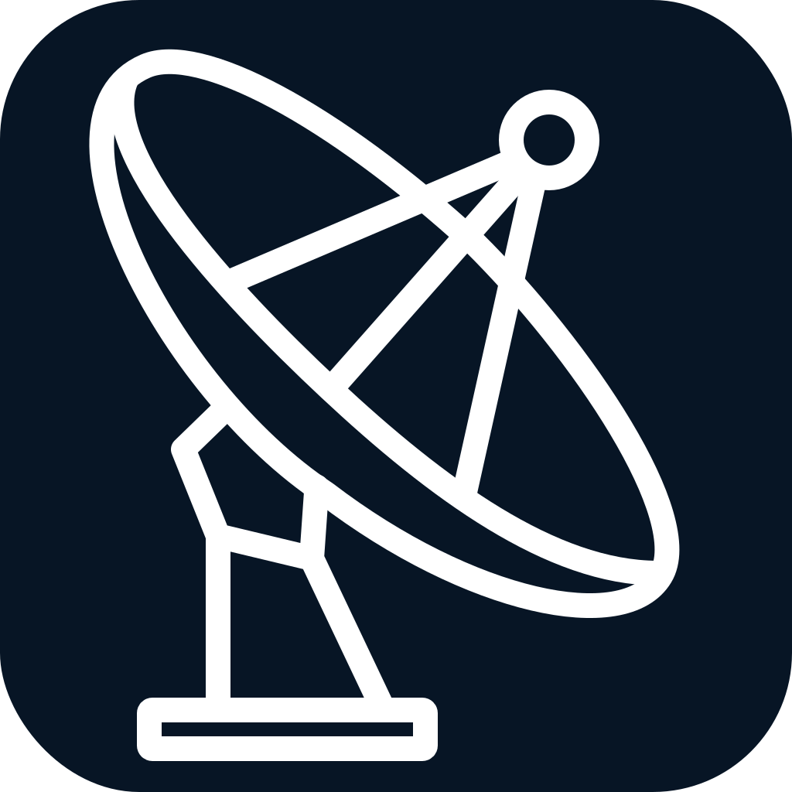

<p align="center">
  <a href="https://initsignal.com">
    
  </a>
</p>

<h1 align="center">InitSignal Swift</h1>

<p align="center"><strong>Know when users arrive,</strong></p>

<p align="center">Track first-time app launches and revenue in real time with a lightweight SDK, live dashboard and instant notifications</p>

<p align="center">
  <a href="https://github.com/InitSignal/initsignal-swift/actions/workflows/ci.yml"></a>
  
  
  
  <a href="LICENSE"></a>
</p>

<p align="center">
  <a href="https://initsignal.com">Website</a> ·
  <a href="https://initsignal.com/app/">Dashboard</a> ·
  <a href="mailto:support@initsignal.com">Support</a>
</p>

Tiny Swift SDK for sending exactly one first-launch signal to InitSignal.

## Requirements

- iOS/iPadOS 16+
- macOS 13+
- Mac Catalyst 16+

InitSignal uses StoreKit 2 app transaction metadata to send only for customers whose original app download/purchase version matches the current app version. Existing customers who installed an older version are skipped.

## Install

Add this package in Xcode:

```txt
https://github.com/initsignal/initsignal-swift.git
```

## Usage

App delegate:

```swift
import InitSignal

func application(
    _ application: UIApplication,
    didFinishLaunchingWithOptions launchOptions: [UIApplication.LaunchOptionsKey: Any]?
) -> Bool {
    InitSignal.start("is_live_...")
    return true
}
```

SwiftUI app:

```swift
import InitSignal
import SwiftUI

@main
struct ExampleApp: App {
    init() {
        InitSignal.start("is_live_...")
    }

    var body: some Scene {
        WindowGroup {
            ContentView()
        }
    }
}
```

`start` returns immediately, never throws, and fails quietly if the network or InitSignal service is unavailable.

## Debug mode

Use debug mode while verifying the integration from Xcode:

```swift
InitSignal.start { options in
    options.appKey = "is_live_..."
    options.debug = true
}
```

In local debug builds, `debug = true` sends a fresh `development` signal on each app launch and prints SDK diagnostics to the Xcode console. Leave it off for release builds.

## Behavior

- Sends one accepted first-launch event per app install/app lifetime outside debug mode.
- Sends only when StoreKit confirms the app's original download/purchase version matches the current app version.
- Includes the App Store storefront country/region code when StoreKit provides it, for example `USA`. This is App Store account/storefront metadata, not device location.
- Skips existing customers whose original app version is older than the current version.
- If StoreKit cannot verify the app transaction, skips quietly and tries again on a later launch.
- Local debug builds do not send unless `options.debug = true`.
- If the first attempt fails, retries quietly on later launches using the same launch timestamp for server-side deduplication.
- Marks the launch as sent only after InitSignal accepts the event.
- Does not collect user identifiers, sessions, screen views, IDFA, IDFV, Apple ID, email, device location, contacts, photos, or files.
- Uses only Foundation and a short-lived ephemeral URLSession request.

## License

InitSignal Swift is available under the [Apache License 2.0](LICENSE). Access to the hosted InitSignal service is governed separately by the InitSignal Terms of Service.
